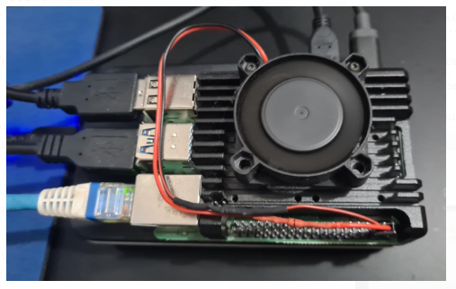

<div align="center">
   <br /> <br />
  <h1>Raspberry Pi 4 as a Home Server</h1>
</div>
<br />

## Prepare ssd

1. Open "Raspberry PI Imager" app;
2. Choose Ubuntu Server;
3. Configure ssh;
4. Configure hostname: rpi-4
5. Configure user and pass: pi / pi
6. Write image;

## Connect via ssh
```Shell
ssh pi@pi_ip_address
password: pi
```

## Update Ubuntu
```
sudo apt update
sudo apt -y upgrade
```

## Configure static IP
Edit `/etc/netplan/01-netcfg.yaml ` file:
```yml
network:
  version: 2
  ethernets:
    eth0:
      dhcp4: false
      addresses: [192.168.0.25/24]
      routes:
        - to: default
          via: 192.168.0.1
      nameservers:
        addresses: [8.8.8.8, 1.1.1.1]
```
Run command:
```shell
sudo netplan apply
```

## Install Docker

- https://docs.docker.com/engine/install/ubuntu/
- https://docs.docker.com/engine/install/linux-postinstall/


## Install Portainer

- https://docs.portainer.io/start/install-ce/server/docker/linux

## Install Samba

Create folder

```shell
mkdir /home/pi/public
sudo chmod 0777 /home/pi/public
sudo chown -R nobody:nogroup /home/pi/public
```

Install samba

```shell
sudo apt update
sudo apt install samba -y
samba -V
systemctl status smbd
sudo smbpasswd -a pi
```

Edit `/etc/samba/smb.conf` file:

```
[global]
workgroup = WORKGROUP
server string = Samba Server %v
security = user
map to guest = Bad User
dns proxy = no

[public]
path = /home/pi/public
valid users = pi
read only = no
create mode = 0777
directory mode = 0777
```

Test samba configuration

```shell
testparm
```

Restart samba

```shell
sudo systemctl restart smbd.service
```

 
 ## Problem with locale
 
Sat Jul 28, 2012 7:57 pm <br>
To fix this SSH problem, edit the file /etc/ssh/ssh_config on the SSH client (not the RPi) and remove the line:
```
SendEnv LANG LC_*
```
https://www.raspberrypi.org/forums/viewtopic.php?f=50&t=11870

## Other

- libseccomp2_2.5.1-1_armhf.deb
- dpkg -l | grep libseccomp2
- https://askubuntu.com/questions/1263284/apt-update-throws-signature-error-in-ubuntu-20-04-container-on-arm 
- https://www.zdnet.com/article/raspberry-pi-extending-the-life-of-the-sd-card/
- https://www.raspberrypi.org/documentation/hardware/raspberrypi/bootmodes/msd.md
- Measure temp: `vcgencmd measure_temp`
- https://xavierberger.github.io/RPi-Monitor-docs/index.html

