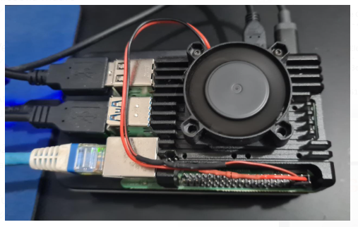

<div align="center">
   <br /> <br />
  <h1>Raspberry Pi 4 as a Home Server</h1>
</div>
<br />

## Table of contents

- [Prepare SSD](#prepare-ssd)
- [Connect via SSH](#connect-via-ssh)
- [Configure USB Sata Adapter](#configure-usb-sata-adapter)
- [Update Ubuntu](#update-ubuntu)
- [Configure static IP](#configure-static-ip)
- [Install Docker](#install-docker)
- [Link Dockge Stacks](#link-dockge-stacks)
- [Install Samba](#install-samba)
- [Install File Browser](#install-file-browser)
- [Install MiniDLNA](#install-minidlna)
- [Install PiHole](#install-pihole)
- [Install Transmission](#install-transmission)
- [Install JDownloader2](#install-jdownloader2)
- [Other](#other)

## Prepare SSD

1. Open "Raspberry PI Imager" app;
2. Choose Ubuntu Server LTS 64bits;
3. Configure ssh;
4. Configure hostname: rpi-4
5. Configure user and pass: pi / pi
6. Write image;
7. Connect disk to USB 2.0;

 
## Connect via SSH

  ```Shell
  ssh pi@pi_ip_address
  password: pi
  ```

## Configure USB Sata Adapter 

1. Connect SSD via USB 2.0 port;
2. Type below command:
   ```shell
   lsusb
   ```
3. Check the output:
   ```
   Bus 002 Device 002: ID 152d:0583 JMicron Technology Corp. / JMicron USA Technology Corp. JMS583Gen 2 to PCIe Gen3x2 Bridge
   ```
4. Copy the ID (eg: `152d:0583`);
5. Run below command:
   ```shell
   sudo vim /boot/firmware/cmdline.txt
   ```
6. Insert below snipet at the begining of line (use the ID):
   ```
   usb-storage.quirks=152d:0583:u
   ``` 
7. Save the file;
8. Shutdonw Raspberry Pi; 
9. Disconnect Sata Adapter from USB 2.0, connect it to USB 3.0;
10. Turn it on;
 

## Update Ubuntu

  ```shell
  sudo apt update
  sudo apt -y upgrade
  ```

## Configure static IP

- Edit `/etc/netplan/01-netcfg.yaml ` file:
  ```yml
  network:
    version: 2
    ethernets:
      eth0:
        dhcp4: false
        addresses: [192.168.0.25/24]
        routes:
          - to: default
            via: 192.168.0.1
        nameservers:
          addresses: [8.8.8.8, 1.1.1.1]
  ```
- Run command:
  ```shell
  sudo netplan apply
  ```
- Check if adapter accepted configuration:
  ```
  ip addr show eth0
  ```

## Install Docker

- https://docs.docker.com/engine/install/ubuntu/
- https://docs.docker.com/engine/install/linux-postinstall/

## Link Dockge Stacks

Clone this repository on the `rpi-4` host and create a symbolic link so Dockge reads the stack files from `/opt/stacks`.

  ```shell
  git clone <repo-url> /home/pi/rpi-4
  ln -s /home/pi/rpi-4/stacks /opt/stacks
  ```

Dockge will use the compose files from `/opt/stacks`.

## Install Samba

- Create folders:

  ```shell
  mkdir -p /home/pi/public
  sudo chmod -R 0777 /home/pi/public
  sudo chown -R nobody:nogroup /home/pi/public
  ```

- Install samba service:

  ```shell
  sudo apt update
  sudo apt install samba -y
  samba -V
  systemctl status smbd
  sudo smbpasswd -a pi
  ```

- Edit `/etc/samba/smb.conf` file:

  ```
  [global]
  workgroup = WORKGROUP
  server string = Samba Server %v
  security = user
  map to guest = Bad User
  dns proxy = no

  [public]
  path = /home/pi/public
  valid users = pi
  read only = no
  create mode = 0777
  directory mode = 0777
  ```

- Test samba configuration

  ```shell
  testparm
  ```

- Restart samba

  ```shell
  sudo systemctl restart smbd.service
  ```

## Install File Browser

- Create db and configuration files:
  ```shell
  mkdir -p /home/pi/docker/app_data/filebrowser/
  mkdir -p /home/pi/public/
  touch /home/pi/docker/app_data/filebrowser/filebrowser.db
  touch /home/pi/docker/app_data/filebrowser/settings.json
  ```

- Fill settings.json file with bellow content:
  ```yml
  {
    "port": 80,
    "baseURL": "",
    "address": "",
    "log": "stdout",
    "database": "/database/filebrowser.db",
    "root": "/srv"
  }
  ```

- The compose file for this service is managed in `./stacks/filebrowser/compose.yaml` and Dockge reads it from `/opt/stacks`.
- Add USER environment variables;
- Start the stack;

## Install MiniDLNA

- Create folders:

  ```shell
  mkdir -p /home/pi/public/media/movies
  mkdir -p /home/pi/public/media/tv
  mkdir -p /home/pi/public/media/other
  mkdir -p /home/pi/public/pics
  ```

- The compose file for this service is managed in `./stacks/minidlna/compose.yaml` and Dockge reads it from `/opt/stacks`.
- Start the stack.

## Install PiHole

- Create folders:

  ```shell
  mkdir -p /home/pi/docker/app-data/etc-dnsmasq.d
  mkdir -p /home/pi/docker/app-data/etc-pihole
  ```

- The compose file for this service is managed in `./stacks/pihole/compose.yaml` and Dockge reads it from `/opt/stacks`.
- Start the stack.
- Go to http://rpi4-ip/admin

Throubleshooting:   
IF port 53 already in use, disable systemd-resolved service and change /etc/resolv.conf. 
> From: https://discourse.pi-hole.net/t/docker-unable-to-bind-to-port-53/45082/7 

## Install Transmission

- Create folders:

  ```shell
  mkdir -p /home/pi/public/torrents/watch
  ```

- The compose file for this service is managed in `./stacks/transmission/compose.yaml` and Dockge reads it from `/opt/stacks`.

## Install JDownloader2

- Create folders:

  ```shell
  mkdir -p    - /home/pi/public/downloads
  mkdir -p    - /home/pi/docker/app-data/jdownloader
  ```

- The compose file for this service is managed in `./stacks/jdownloader2/compose.yaml` and Dockge reads it from `/opt/stacks`.
  
## Install Glances

- The compose file for this service is managed in `./stacks/glances/compose.yaml` and Dockge reads it from `/opt/stacks`.

## Other

- https://askubuntu.com/questions/1263284/apt-update-throws-signature-error-in-ubuntu-20-04-container-on-arm 
- https://www.zdnet.com/article/raspberry-pi-extending-the-life-of-the-sd-card/
- https://www.raspberrypi.org/documentation/hardware/raspberrypi/bootmodes/msd.md
- Measure temp: `vcgencmd measure_temp`
- https://xavierberger.github.io/RPi-Monitor-docs/index.html
